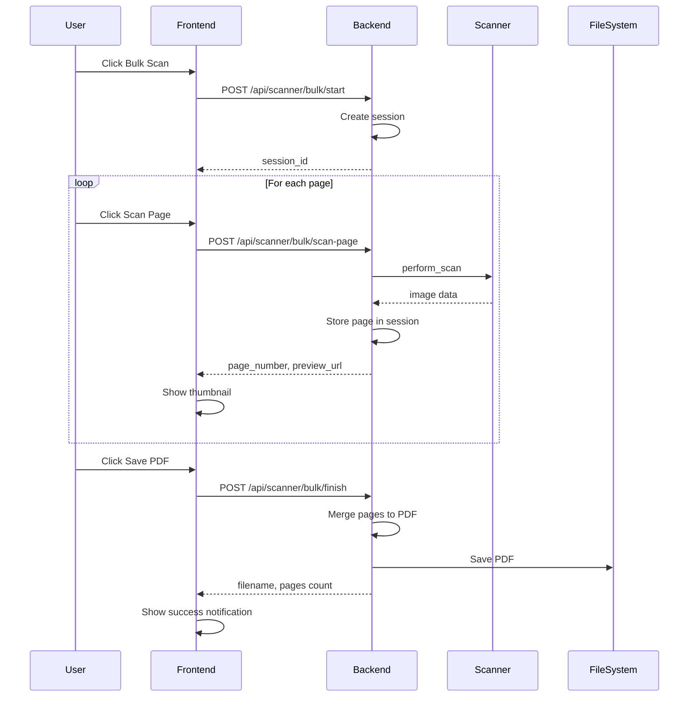

# Bulk Scan Feature Plan

## Overview

This document outlines the implementation plan for the bulk scan feature, which allows users to scan multiple pages and merge them into a single PDF document.

## Requirements Summary

- **PDF Merging**: All scanned pages merged into a single PDF
- **Scan Flow**: Manual trigger - user clicks "Scan Page" for each page
- **Page Preview**: Show thumbnails of scanned pages
- **Cancel Option**: Allow canceling and discarding all pages

## Architecture

### Backend Changes

#### 1. New Dependencies

Add to `backend/requirements.txt`:
```
img2pdf==0.5.1
Pillow==10.2.0
```

**Why img2pdf?**
- Lightweight and pure Python
- Better quality than PyPDF2 for image-to-PDF conversion
- Maintains original image quality
- Smaller output file size

#### 2. Bulk Scan Session Management

Create `backend/app/services/bulk_scan_service.py`:

```python
class BulkScanSession:
    """Manages a bulk scan session."""
    def __init__(self, session_id: str, config: dict):
        self.session_id = session_id
        self.config = config
        self.pages: List[bytes] = []  # Store page data in memory
        self.page_paths: List[Path] = []  # Or store in temp files
        self.created_at = datetime.now()
    
    def add_page(self, page_data: bytes) -> int:
        """Add a scanned page. Returns page number."""
        pass
    
    def get_page_preview(self, page_num: int) -> bytes:
        """Get preview image for a page."""
        pass
    
    def finish(self) -> Path:
        """Merge all pages into PDF and return path."""
        pass
    
    def cancel(self):
        """Discard all pages and cleanup."""
        pass
```

#### 3. New API Endpoints

| Method | Endpoint | Description |
|--------|----------|-------------|
| POST | `/api/scanner/bulk/start` | Start a new bulk scan session |
| POST | `/api/scanner/bulk/scan-page` | Scan and add a page to current session |
| GET | `/api/scanner/bulk/preview/<page>` | Get preview image for a page |
| POST | `/api/scanner/bulk/finish` | Finish and save the merged PDF |
| DELETE | `/api/scanner/bulk/cancel` | Cancel and discard all pages |
| GET | `/api/scanner/bulk/status` | Get current bulk scan status |

#### 4. API Request/Response Examples

**Start Bulk Scan**
```json
// POST /api/scanner/bulk/start
// Request
{
    "ip": "192.168.13.93",
    "dpi": 300,
    "format": "A4",
    "colormode": "RGB24"
}

// Response
{
    "success": true,
    "session_id": "bulk_20260217_093000",
    "message": "Bulk scan session started"
}
```

**Scan Page**
```json
// POST /api/scanner/bulk/scan-page
// Request
{
    "session_id": "bulk_20260217_093000"
}

// Response
{
    "success": true,
    "page_number": 1,
    "preview_url": "/api/scanner/bulk/preview/1",
    "message": "Page 1 scanned"
}
```

**Finish Bulk Scan**
```json
// POST /api/scanner/bulk/finish
// Request
{
    "session_id": "bulk_20260217_093000",
    "output": "multi_page_document"
}

// Response
{
    "success": true,
    "filename": "multi_page_document.pdf",
    "pages": 5,
    "output_dir": "./scandir"
}
```

### Frontend Changes

#### 1. New Components

**BulkScanModal.vue** - Modal dialog for bulk scanning:
```
┌─────────────────────────────────────────────────────────────┐
│  Bulk Scan - 3 pages scanned                          [X]   │
├─────────────────────────────────────────────────────────────┤
│                                                             │
│  ┌─────────┐ ┌─────────┐ ┌─────────┐ ┌─────────┐          │
│  │  Page 1 │ │  Page 2 │ │  Page 3 │ │    +    │          │
│  │  [img]  │ │  [img]  │ │  [img]  │ │ Add Page│          │
│  │  [del]  │ │  [del]  │ │  [del]  │ │         │          │
│  └─────────┘ └─────────┘ └─────────┘ └─────────┘          │
│                                                             │
│  Status: Ready to scan next page                           │
│                                                             │
├─────────────────────────────────────────────────────────────┤
│                    [Cancel]  [Save PDF]                     │
└─────────────────────────────────────────────────────────────┘
```

**PageThumbnail.vue** - Individual page thumbnail:
- Shows preview image
- Page number badge
- Delete button
- Loading state during scan

#### 2. Store Updates

Add to `frontend/src/stores/scanner.js`:

```javascript
// Bulk scan state
bulkScanSession: null,
bulkScanPages: [],
isBulkScanning: false,
bulkScanPageInProgress: false,

// Actions
startBulkScan(config) {},
scanBulkPage() {},
deleteBulkPage(pageNum) {},
finishBulkScan(filename) {},
cancelBulkScan() {}
```

#### 3. UI Changes to ScanForm.vue

Replace single "Start Scan" button with:

```html
<div class="scan-buttons">
    <button class="btn btn-primary" @click="singleScan">
        Single Scan
    </button>
    <button class="btn btn-secondary" @click="startBulkScan">
        Bulk Scan
    </button>
</div>
```

## Implementation Flow

### Sequence Diagram



## Technical Details

### PDF Merging Implementation

```python
import img2pdf
from PIL import Image
import io

def merge_pages_to_pdf(pages: List[bytes], output_path: Path) -> Path:
    """Merge multiple page images into a single PDF.
    
    Args:
        pages: List of image data (bytes) for each page
        output_path: Path to save the merged PDF
        
    Returns:
        Path to the created PDF file
    """
    # Convert all pages to JPEG if needed
    jpeg_pages = []
    for page_data in pages:
        img = Image.open(io.BytesIO(page_data))
        if img.mode != 'RGB':
            img = img.convert('RGB')
        buffer = io.BytesIO()
        img.save(buffer, format='JPEG', quality=95)
        jpeg_pages.append(buffer.getvalue())
    
    # Merge into PDF
    with open(output_path, 'wb') as f:
        f.write(img2pdf.convert(jpeg_pages))
    
    return output_path
```

### Session Storage Strategy

**Option A: In-Memory Storage**
- Pros: Fast, no temp files
- Cons: Memory usage, lost on restart

**Option B: Temporary Files**
- Pros: Persistent across requests, lower memory
- Cons: Need cleanup, disk I/O

**Recommendation**: Use temporary files with automatic cleanup

```python
import tempfile
import uuid

class BulkScanSession:
    def __init__(self, config: dict):
        self.session_id = str(uuid.uuid4())
        self.config = config
        self.temp_dir = tempfile.mkdtemp(prefix='bulk_scan_')
        self.pages: List[Path] = []
```

## File Structure After Implementation

```
backend/
├── app/
│   ├── routes/
│   │   ├── scanner.py      # Add bulk scan endpoints
│   │   └── ...
│   └── services/
│       ├── scan_service.py
│       └── bulk_scan_service.py  # NEW
└── requirements.txt        # Add img2pdf, Pillow

frontend/
└── src/
    ├── components/
    │   ├── ScanForm.vue         # Modified: two buttons
    │   ├── BulkScanModal.vue    # NEW
    │   └── PageThumbnail.vue    # NEW
    └── stores/
        └── scanner.js           # Add bulk scan state
```

## Testing Checklist

- [ ] Single scan still works as before
- [ ] Bulk scan starts correctly
- [ ] Pages are scanned and stored
- [ ] Thumbnails display correctly
- [ ] Pages can be deleted individually
- [ ] PDF is generated with correct page order
- [ ] Cancel discards all pages
- [ ] Session cleanup works properly
- [ ] Error handling for scanner failures
- [ ] Large number of pages (10+) works

## Future Enhancements

1. **Page Reordering**: Drag-and-drop to reorder pages
2. **Page Rotation**: Rotate individual pages
3. **Auto-detect**: Automatically detect when a new page is placed
4. **PDF Options**: Choose PDF quality/compression
5. **Session Persistence**: Resume interrupted bulk scans
