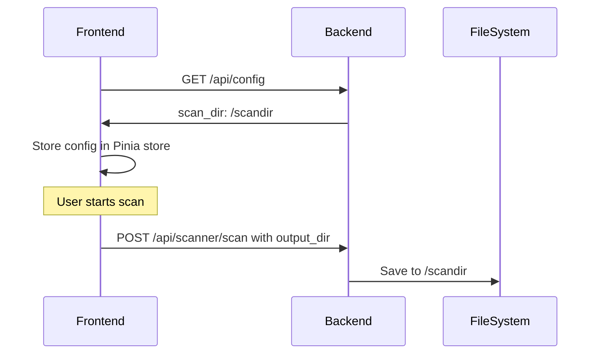

# Frontend Configuration from Environment Variable

## Problem Statement

When creating Docker images, the frontend part uses a hardcoded path (`./scandir`) for saving scanned files instead of using the environment variable configured for the backend. This causes a mismatch between where the frontend thinks files should be saved and where the backend actually saves them.

## Current State

- **Backend** ([`backend/config.py`](backend/config.py:9)): Uses `SCAN_DIR` environment variable with default `'./scandir'`
- **Frontend** ([`frontend/src/stores/scanner.js`](frontend/src/stores/scanner.js:17)): Has hardcoded `output_dir: './scandir'`
- **Docker Compose** ([`docker-compose.yml`](docker-compose.yml:17)): Backend has `SCAN_DIR=/scandir`, frontend has no configuration

## Solution: Fetch Configuration from Backend API

The frontend will fetch the scan directory configuration from the backend API at startup. This ensures the frontend always uses the correct path that the backend is configured with.

### Architecture



## Implementation Plan

### 1. Add Backend API Endpoint

**File**: [`backend/app/routes/scanner.py`](backend/app/routes/scanner.py)

Add a new endpoint to expose configuration:

```python
@scanner_bp.route('/config', methods=['GET'])
def get_config():
    """Get scanner configuration including scan directory."""
    from flask import current_app
    return jsonify({
        'success': True,
        'config': {
            'scan_dir': current_app.config['SCAN_DIR']
        }
    })
```

### 2. Update Frontend API Service

**File**: [`frontend/src/services/api.js`](frontend/src/services/api.js)

Add a method to fetch configuration:

```javascript
export const configApi = {
  getConfig() {
    return api.get('/scanner/config')
  }
}
```

### 3. Update Frontend Store

**File**: [`frontend/src/stores/scanner.js`](frontend/src/stores/scanner.js)

- Remove hardcoded `output_dir` default value
- Add action to fetch configuration from backend with retry logic
- Add state for tracking config loading status
- Initialize configuration on app startup

```javascript
state: () => ({
  config: {
    ip: '192.168.13.93',
    dpi: 300,
    format: 'A4',
    colormode: 'RGB24',
    pdf: true,
    output: '',
    output_dir: null  // Will be fetched from backend
  },
  
  // Config loading state
  isConfigLoading: false,
  configLoadError: null,
  configLoadRetries: 0,
  
  // ... rest of state
}),

actions: {
  /**
   * Fetch configuration from backend with retry logic
   * @param {number} maxRetries - Maximum number of retry attempts
   * @param {number} retryDelay - Delay between retries in milliseconds
   */
  async fetchConfig(maxRetries = 3, retryDelay = 2000) {
    this.isConfigLoading = true
    this.configLoadError = null
    
    for (let attempt = 1; attempt <= maxRetries; attempt++) {
      try {
        const response = await configApi.getConfig()
        if (response.data.success) {
          this.config.output_dir = response.data.config.scan_dir
          this.configLoadRetries = attempt - 1
          this.isConfigLoading = false
          return true
        }
      } catch (err) {
        console.error(`Failed to fetch config (attempt ${attempt}/${maxRetries}):`, err)
        this.configLoadRetries = attempt
        
        if (attempt < maxRetries) {
          // Wait before retrying
          await new Promise(resolve => setTimeout(resolve, retryDelay))
        } else {
          // All retries exhausted, use fallback
          this.configLoadError = 'Could not connect to backend server'
          this.config.output_dir = './scandir'  // Fallback to default
          this.showNotification(
            'Using default scan directory. Backend server may be unavailable.',
            'warning'
          )
        }
      }
    }
    
    this.isConfigLoading = false
    return false
  },
  
  /**
   * Check if config is ready (output_dir is set)
   */
  isConfigReady() {
    return this.config.output_dir !== null
  },
  // ... rest of actions
}
```

### 4. Initialize Configuration on App Startup

**File**: [`frontend/src/App.vue`](frontend/src/App.vue)

Call `fetchConfig()` when the app mounts and show loading state:

```javascript
import { useScannerStore } from './stores/scanner'
import { storeToRefs } from 'pinia'

const scannerStore = useScannerStore()
const { isConfigLoading, configLoadError } = storeToRefs(scannerStore)

onMounted(async () => {
  await scannerStore.fetchConfig()
})
```

Add a loading indicator in the template:

```vue
<template>
  <div v-if="isConfigLoading" class="config-loading">
    <div class="spinner"></div>
    <p>Connecting to backend...</p>
  </div>
  <div v-else class="app-container">
    <!-- Existing app content -->
  </div>
</template>
```

## Files to Modify

| File | Changes |
|------|---------|
| [`backend/app/routes/scanner.py`](backend/app/routes/scanner.py) | Add `/config` endpoint |
| [`frontend/src/services/api.js`](frontend/src/services/api.js) | Add `configApi` object |
| [`frontend/src/stores/scanner.js`](frontend/src/stores/scanner.js) | Add `fetchConfig` action with retry logic, add loading state, remove hardcoded default |
| [`frontend/src/App.vue`](frontend/src/App.vue) | Initialize config on mount, add loading indicator |

## Benefits

1. **Single Source of Truth**: Backend configuration is the authoritative source
2. **No Docker Rebuild Required**: Configuration changes only require restarting containers
3. **Consistent Behavior**: Frontend always matches backend configuration
4. **Backward Compatible**: Falls back to default if API is unavailable
5. **Robust Error Handling**: Retry logic handles temporary backend unavailability during container startup
6. **User Feedback**: Loading indicator and warning notifications keep users informed

## Testing

1. Start the Docker containers
2. Verify frontend fetches `/scandir` from backend
3. Perform a scan and verify file is saved to correct location
4. Test with custom `SCAN_DIR` environment variable
